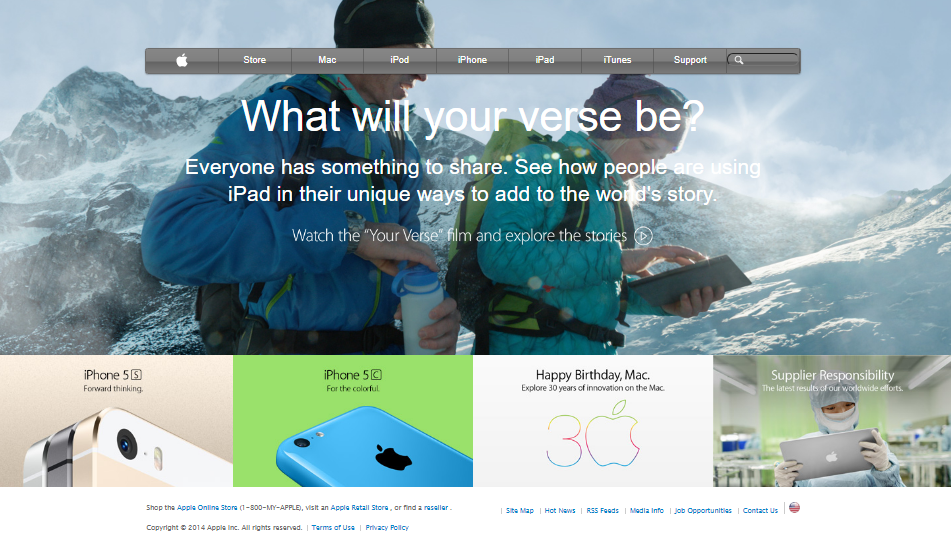

# Apple-websiteclone
this project is intended to create a clone of the apple page 

Additional description about the project and its features.

## Built With

- I am creating a clone of this single page apple website from the archives using html and css,the project is focusing on backgrounds and gradients 

👤 **Ssegawa Alvin Louis K**

- Github: [@githubhandle](https://github.com/alvinlouis29)
## Built With

- HTML,
- CSS

### Goal

- To match the original Apple web page [here](https://web.archive.org/web/20140301004610/http://www.apple.com/)

## Live Webpage

[Click Here](https://raw.githack.com/alvinlouis29/Apple-websiteclone/development/index.html)
## Show your support

Give a ⭐️ if you like this project!
